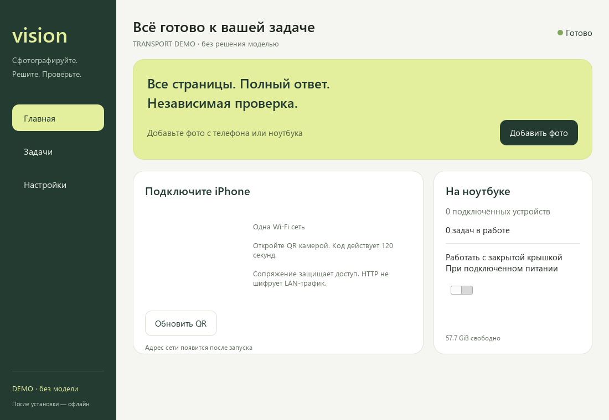
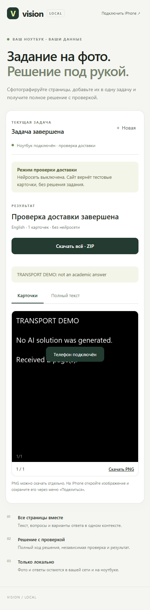
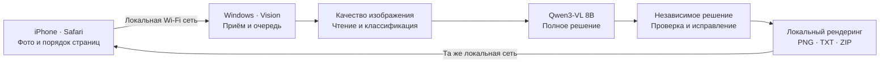

# Vision

### Сфотографируйте. Решите. Проверьте.

**Локальный помощник для учебных заданий: Windows-ноутбук решает, iPhone фотографирует и получает ответ.**

Несколько страниц — одна задача. Полное решение, независимая проверка, читаемые карточки и исходный текст. После первоначальной настройки обработка работает без внешнего Интернета.

**Версия 0.4.0 · Windows 11 x64 · Qwen3-VL 8B · llama.cpp CUDA · iPhone Safari**

[**Скачать Windows-установщик**](https://github.com/angelovdima15-cloud/local-offline-vision-solver/releases/tag/v0.4.0-preview) · [Инструкция пользователю](docs/customer-start.md) · [Результаты проверок](docs/validation.md) · [Документация API](docs/api.md)

> **Статус выпуска:** предварительная сборка для испытаний на целевых устройствах. Программные проверки пройдены; точность Qwen, скорость на RTX 4060, настоящий iPhone/Safari и установка на чистой Windows ещё требуют аппаратной приёмки. `release_ready: false`.

## Как это выглядит



<details>
<summary>Интерфейс на телефоне</summary>



</details>

Скриншоты сняты с собранной программы в режиме проверки доставки. Ответ на них демонстрационный: модель в этом режиме выключена.

## От фотографии до ответа



Ноутбук и телефон подключаются к общей Wi-Fi сети или ноутбук подключается к точке доступа iPhone. Интернет нужен для первоначальной загрузки компонентов; для последующих заданий нужна только связь между устройствами.

## Что умеет Vision

| Возможность | Как реализовано |
| --- | --- |
| Несколько страниц | До 12 фотографий в одной задаче, предпросмотр и изменение порядка |
| Оригиналы фотографий | Передача без намеренного уменьшения; JPEG и HEIF/HEIC; отдельный локальный предпросмотр |
| Решение с проверкой | Чтение задания, классификация, решение, независимая проверка и финальный аудит |
| Восстановление чтения | Повторная интерпретация с обработкой/кадрированием при сомнениях; оригиналы остаются доступны |
| Изоляция задач | Новая задача создаёт отдельную сессию и новый контекст модели |
| Карточки ответа | Локальный рендеринг формул и текста, разбивка длинных решений, скачивание PNG/TXT/ZIP |
| Сохранение работы | Очередь SQLite WAL и восстановление состояния после перезапуска |
| Повторный вывод | Проверенный текст сохраняется при ошибке рендеринга; карточки можно повторить без нового решения |
| Подключение телефона | Одноразовый QR-код и локальное сопряжение устройства |
| Windows-приложение | Мастер установки модели, задачи, результаты, настройки и системный трей |
| Контроль компонентов | Закреплённые версии, SHA256, возобновление загрузки и локальные журналы |

**Языки заданий:** английский, русский, казахский. Ответ должен следовать основному языку инструкции.

**Предметы, предусмотренные пайплайном:** математика, физика, информатика, английский/IELTS, казахский язык, география на казахском и тесты с выбором ответа. Покрытие предметов в коде ещё не является подтверждением качества модели на реальных заданиях.

## Быстрый старт

1. Скачайте **`Vision.exe`** из [выпуска 0.4.0](https://github.com/angelovdima15-cloud/local-offline-vision-solver/releases/tag/v0.4.0-preview) и установите на Windows-ноутбук.
2. Откройте Vision. Мастер проверит компьютер, предложит каталог данных и загрузит модель и CUDA runtime. Загрузка модели с проектором — примерно **6,19 ГБ**, runtime скачивается дополнительно. Первоначально нужен Интернет.
3. Подключите ноутбук и iPhone к одной Wi-Fi сети либо подключите ноутбук к точке доступа iPhone.
4. Откройте QR-код в Vision камерой iPhone и перейдите в Safari. QR действует **120 секунд**; при необходимости обновите его.
5. Добавьте фотографии, проверьте порядок страниц и нажмите **«Решить»**.
6. Получите полный текст и карточки. Скачайте отдельные PNG или весь ZIP на телефон.

Если телефон не видит ноутбук, проверьте адрес сети и разрешение Windows Firewall в настройках Vision. Правило приложения ограничено частной сетью, локальной подсетью и выбранным портом API. Порт модели наружу не открывается.

Python, Qt, Mac, Xcode и установка приложения на iPhone пользователю не нужны. Python и библиотеки входят в Windows-пакет. CUDA Toolkit отдельно не требуется; совместимый драйвер NVIDIA необходим.

[Подробная инструкция: установка, сеть, скачивание и устранение ошибок →](docs/customer-start.md)

## Требования и текущие ограничения

| Компонент | Целевая конфигурация |
| --- | --- |
| ОС | Windows 11 x64 |
| Видеокарта | NVIDIA RTX 4060 Laptop, **8 ГБ VRAM** |
| Оперативная память | 16 ГБ, рекомендуется 32 ГБ |
| Свободное место | Минимум 20 GiB для установки и компонентов |
| Телефон | iPhone с Safari и доступом к той же локальной сети |
| Модель | Qwen3-VL 8B, исходная конфигурация Q4_K_M + F16 projector |

Q4_K_M — стартовая конфигурация, а не результат сравнительного бенчмарка квантований. Выбор лучшей квантовки, VRAM и время ответа необходимо измерить на целевом ноутбуке. **10–30 секунд обычно / до 60 секунд — цели проекта, пока не подтверждённые измерениями.** Проверка решения не отключается ради скорости.

Лимиты загрузки: **12 страниц**, **60 MiB на файл**, **300 MiB на задачу**, **64 млн пикселей на изображение**. Длительные ответы сохраняются полностью. Формулы выводятся локальным `mathtext`: поддерживается его подмножество LaTeX, отдельный TeX-дистрибутив не нужен. Сгенерированный код не исполняется.

Закрытие окна оставляет Vision в трее. Полный выход завершает принадлежащие приложению процессы. Режим закрытой крышки меняет действие только при питании от сети и ведёт журнал восстановления; настоящий сон/гибернация прекращает вычисления. Охлаждение и длительную работу необходимо проверить на конкретном ноутбуке.

## Локальность и доступ к данным

- Фотографии, ответы, обработка и журналы находятся на ноутбуке. Для решения не используются облачные AI/OCR API, аккаунты или удалённое хранилище.
- Модель доступна только через loopback; телефон обращается к локальному API Vision.
- Сопряжение выдаёт HttpOnly cookie на 30 дней. Задачи разделены по владельцу; знание UUID не даёт доступа к чужому ответу.
- Локальный сайт использует **HTTP**: сопряжение ограничивает доступ, но **не шифрует трафик**. Используйте доверенную Wi-Fi сеть.
- По умолчанию сессии временные: срок хранения 24 часа. Скачайте нужный ответ до удаления.
- Браузер сохраняет черновик локально, когда доступно его хранилище. При невозможности сохранения показывает предупреждение.

Программа и пользовательские данные хранятся отдельно:

```text
%LOCALAPPDATA%\Programs\VisionSolver\   приложение и библиотеки
%LOCALAPPDATA%\VisionSolver\            настройки, база, модели,
                                        сессии, загрузки и журналы
```

Каталог данных можно изменить в мастере. Обновление сохраняет данные; удаление приложения по умолчанию тоже их сохраняет, удаление данных выбирается отдельно.

## Проверки: что подтверждено

Результаты локальной проверки версии 0.4.0 от **7 октября 2026 года**:

| Проверка | Результат |
| --- | --- |
| Python: API, очередь, изоляция, восстановление, доступ, рендеринг, Windows-процессы | **80 тестов пройдено** |
| Мобильный сайт в Chromium: загрузка, порядок, повтор, восстановление и скачивание | **PASS**, без внешних запросов и JS-ошибок |
| Собранный Windows backend: HTTP, две страницы, оригинальные байты и SHA256 | **PASS** |
| Сайт через собранный backend | **PASS** |
| Собранный GUI: мастер и демонстрационный запуск | **PASS** |
| Пять экранов QML при масштабах 100%, 125%, 150%, 200% | **Проверены** |

В перечисленных проверках inference демонстрационный/симулированный. **Не завершены:** реальные задания Qwen на RTX 4060, Safari и точка доступа iPhone, чистая Windows без Python, реальная первоначальная загрузка/драйвер/перезагрузка, автономное решение после установки и 30 минут работы с закрытой крышкой.

[Подробные результаты и расположение журналов](docs/validation.md) · [План аппаратной приёмки](docs/mvp-acceptance.md)

## Разработка

Разработка и сборка выполняются на Windows. Текущий проверенный набор: Python **3.14**, PySide6 **6.11.2**, PyInstaller **6.22.3**, Playwright **1.63.0**. Ограничения зависимостей находятся в `requirements.lock.txt`; метаданные проекта — в `pyproject.toml`.

```powershell
git clone https://github.com/angelovdima15-cloud/local-offline-vision-solver.git
cd local-offline-vision-solver
.\setup.cmd

# GUI без модели: проверка интерфейса и доставки
.venv\Scripts\python.exe -m local_vision_solver.desktop.main --data-dir .cache\desktop-dev --demo

# Проверки с сохранением полных журналов
.venv\Scripts\python.exe scripts/dev.py check tests
.venv\Scripts\python.exe scripts/acceptance_http.py
.venv\Scripts\python.exe scripts/check_browser.py
.venv\Scripts\python.exe scripts/check_desktop.py --demo
```

Для браузерных проверок устанавливаются только инструменты разработки:

```powershell
.venv\Scripts\python.exe -m pip install playwright==1.63.0
.venv\Scripts\python.exe -m playwright install chromium
```

CLI для диагностики и ручного запуска модели:

```powershell
.venv\Scripts\python.exe -m local_vision_solver --config config.toml doctor
.venv\Scripts\python.exe -m local_vision_solver --help
```

`--config` выбирает конфигурацию; `--data-dir` задаёт изолированные данные. Для модели предусмотрены команды `start-model`, `serve` и `solve`. Demo не решает учебные задания. Параметры запуска описаны в CLI `--help` и [документе по реализации](docs/desktop-implementation.md).

### Сборка установщика

```powershell
.venv\Scripts\python.exe -m pip install pyinstaller==6.22.3
powershell -NoProfile -File scripts/install_build_tools.ps1
.venv\Scripts\python.exe scripts/package_windows.py --check-installer
.venv\Scripts\python.exe scripts/package_source.py
```

Сборщик создаёт свежий payload, выполняет проверки собранных HTTP/browser/GUI компонентов и собирает Inno Setup. Проверка установщика выполняет установку, обновление и удаление в изолированном каталоге; она отказывается менять уже установленный Vision.

Выпуск содержит `Vision.exe`, `Vision.exe.sha256`, `release-manifest.json` и `acceptance-report.json`. Веса и CUDA runtime загружаются мастером отдельно и проверяются по закреплённым SHA256. Исходники публикуются отдельно от установщика.

[GitHub Actions](https://github.com/angelovdima15-cloud/local-offline-vision-solver/actions/workflows/validate.yml) запускает проверки исходников и сборку установщика на Windows. CI с demo не заменяет аппаратную приёмку.

## Структура проекта

```text
src/local_vision_solver/
├── desktop/       Windows GUI, мастер, QML и управление runtime
├── web/           локальный сайт для телефона и ноутбука
├── pipeline.py    чтение, решение, независимая проверка и аудит
└── …              API, очередь, безопасность, изображения и рендеринг
installer/         Inno Setup
scripts/           запуск, диагностика, проверки и упаковка
tests/             автоматические проверки
docs/              инструкции, архитектура и приёмка
benchmarks/        инструменты оценки качества и производительности
```

В GitHub входят исходники, тесты, конфигурации, скрипты, документация и установочный сценарий. Личные фотографии, сессии, токены, журналы, виртуальное окружение, кэши и веса моделей не включаются. Готовый установщик размещается в Releases.

## Документация

- [Первые шаги пользователя](docs/customer-start.md)
- [Передача заказчику](DELIVERY.md)
- [Windows GUI, установка и архитектура](docs/desktop-implementation.md)
- [Локальный API](docs/api.md)
- [Результаты программных проверок](docs/validation.md)
- [Приёмка на целевых устройствах](docs/mvp-acceptance.md)
- [Исходная концепция iPhone/Apple Watch](docs/native-app-concept.md) — сохранена как документ; нативные Apple-приложения не входят в текущий продукт.
